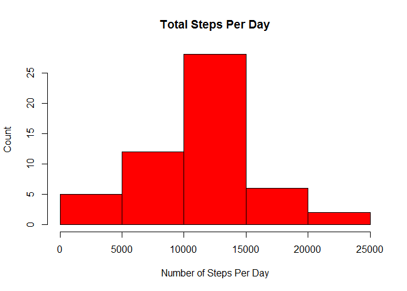
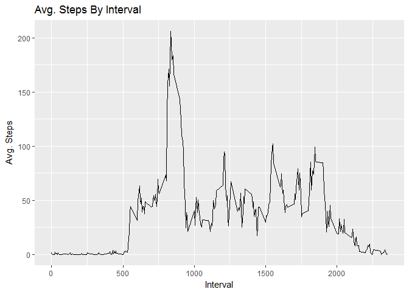
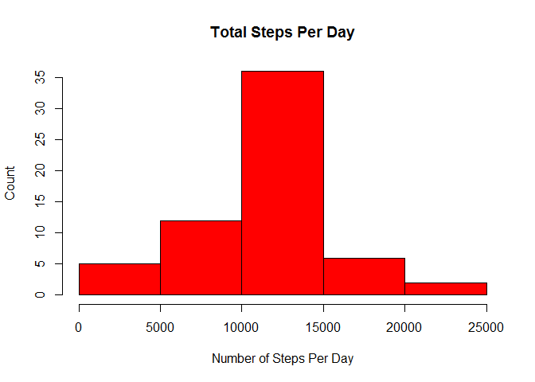
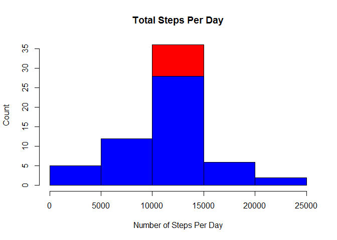
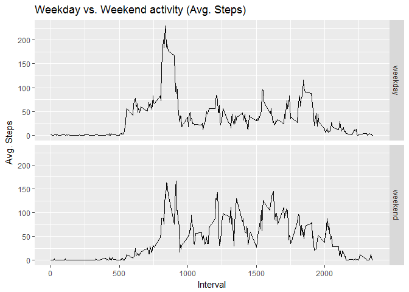

# Reproducible Research: Peer Assessment 1

## Loading and preprocessing the data
# 1. Read in data 

```r
          data <- read.csv("activity.csv")
# Load packages
          library(dplyr)
```

```
## 
## Attaching package: 'dplyr'
```

```
## The following objects are masked from 'package:stats':
## 
##     filter, lag
```

```
## The following objects are masked from 'package:base':
## 
##     intersect, setdiff, setequal, union
```

```r
          library(ggplot2)
```

```
## Warning: package 'ggplot2' was built under R version 3.3.2
```

```r
# 2. Format dates using as.Date()
          data$date <- as.Date(data$date)
```

## What is mean total number of steps taken per day?
# 1. Calculate the total number of steps per day

```r
          steps <- aggregate(steps ~ date, data, sum)
# 2. Using the output of the aggregate function we can create a histogram of total
#    number of steps by day
          hist(steps$steps, xlab = "Number of Steps Per Day", ylab = "Count",
          main = "Total Steps Per Day", col = "red")
```

<!-- -->

```r
# 3. Call a summary of the "steps"" to get the calculated mean and median of
#    the total number of steps per day
          summary(steps$steps)
```

```
##    Min. 1st Qu.  Median    Mean 3rd Qu.    Max. 
##      41    8841   10760   10770   13290   21190
```

## What is the average daily activity pattern?
# 1. Time series plot of interval and avg. number of steps, averaged across all
#    days. First, calculate the mean of the steps by interval

```r
          interval <- aggregate(steps ~ interval, data, mean)
# Now plot interval as a line graph
          ggplot(interval, aes(interval, steps)) + geom_line() + 
          xlab("Interval") + ylab("Avg. Steps") + ggtitle("Avg. Steps By Interval")  
```

<!-- -->

```r
# Determine the maximum value of the mean number of steps to find the interval
          interval[which.max(interval$steps), ]
```

```
##     interval    steps
## 104      835 206.1698
```

## Imputing missing values
# 1. Calculate and report the total number of missing values in the dataset

```r
          table(is.na(data$steps))
```

```
## 
## FALSE  TRUE 
## 15264  2304
```

```r
# 2. Devise a strategy for filling in missing values. Since the mean of the
#    intervals was just calculated, I will use them.
# 3. Create new dataset with the missign values added in using the imputing
#    strategy.
          datanew <- data
          datanew$steps <- ifelse(is.na(datanew$steps) == TRUE, 
          interval$steps[interval$interval %in% datanew$interval], datanew$steps)
# 4. Make a histogram of the total nubmer of steps and calculate the mean and
#    median number of steps per day.
          stepsnew <- aggregate(steps ~ date, datanew, sum)
          hist(stepsnew$steps, xlab = "Number of Steps Per Day", ylab = "Count",
          main = "Total Steps Per Day", col = "red")
```

<!-- -->

```r
# Summary of the data set with imputed values to get new mean and median
          summary(stepsnew$steps)
```

```
##    Min. 1st Qu.  Median    Mean 3rd Qu.    Max. 
##      41    9819   10770   10770   12810   21190
```
# The calculated mean and median on the imputed data are the same (10770) where
# in the original dataset the mean and median were close to each other, but not
# equal (10760 and 10770).
# The overlaid histograms shows the shift of the total counts. 

```r
          hist(stepsnew$steps, xlab = "Number of Steps Per Day", ylab = "Count",
          main = "Total Steps Per Day", col = "red")
          hist(steps$steps, col = "blue", add = T)
```

<!-- -->

## Are there differences in activity patterns between weekdays and weekends?
# 1. Create a new factor variable with two levels - weekday and weekend.

```r
          datanew$day <- as.factor(ifelse(weekdays(datanew$date) %in%
          c("Saturday", "Sunday"), "weekend", "weekday"))
# 2. Make a panel plot of a time series fo 5-min. interval and avg. number of
#    steps taken across weekdays and weekends.
          stepsweek <- aggregate(steps ~ interval + day, datanew, mean)
          ggplot(stepsweek, aes(interval, steps)) + geom_line() +
          facet_grid(day ~ .) + xlab("Interval") + ylab("Avg. Steps") +
          ggtitle("Weekday vs. Weekend activity (Avg. Steps)")
```

<!-- -->
# Observations from the graphs are that more steps are taken throughout the
# interval of time on the weekends than weekdays. Also,activity begins later
# on the weekend days and continues longer into the evening.
